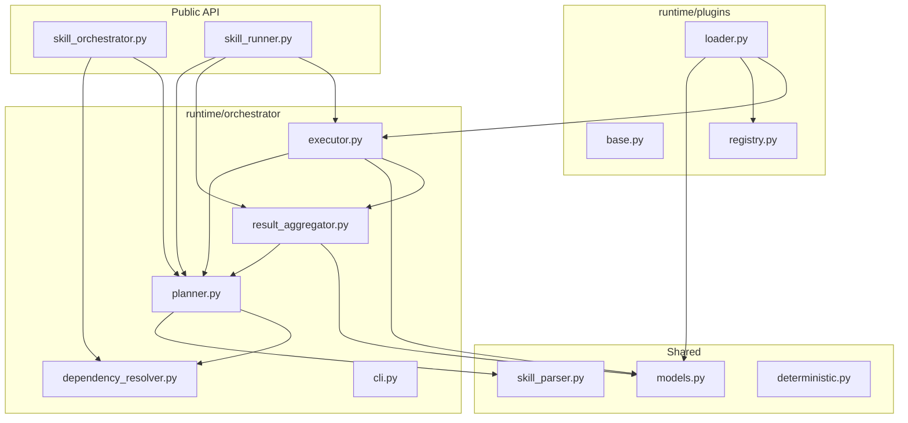

# Updated Dependency Graph

## Runtime package imports



## Skill DAG (unchanged)

24 PML/OCL skills; wave 0 has no deps; B2/I1 depend on B1; etc.
Validate with:

```bash
make validate-dag
```

## Tools expand package

```
expand_agent_specs.py → expand/cli.py → expand/compiler.py
                                      → expand/parser.py
                                      → expand/phases_data.py
                                      → expand/template_engine.py
```

No circular imports between runtime subpackages.
